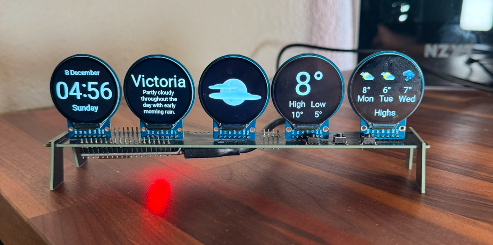
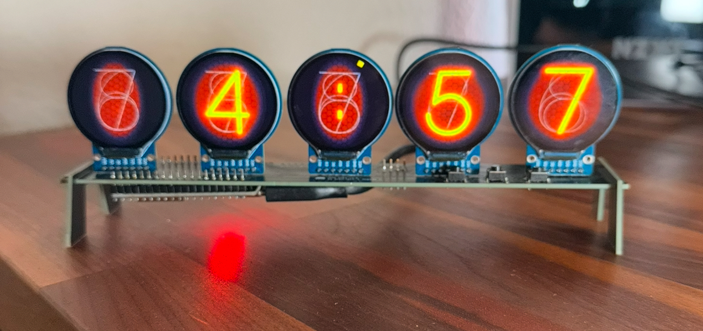
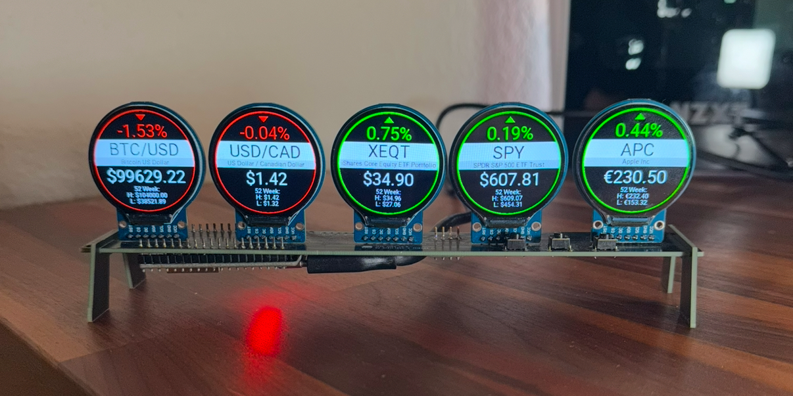

# Welcome To info orbs!
info orbs is a low cost, open source, multi-use desktop widget that can be used for things like time, weather, sports score, stock prices, notifications & much more!

# First, a few housekeeping items for anyone interested in helping with this project, or building one for themselves
- If you would like to help out or have questions, please join my discord [here](https://discord.gg/f5YqpMTJNm) and mention you have questions/want to help out with the project and i'll invite you to the appropriate channels.
- The soldering/ wiring on this is tricky, I'm currently in the process of building out dev kits that will include both full kits with all parts needed, or just PCBs to save hassle on wiring. Please enquire over email at brett@btruner.tech or via the discord above if you'd like to get your hands on one early.
- This was my first "real" project i've ever built, that being said there's likely allot of common sense stuff missed in regards to code structure, file structure, using the wrong variable types, etc. If you see anything of that nature that makes sense to fix please do, I wont be offended.
- I chose the ESP32 for this build due to its low cost and ease of production when I build more refined PCBs, however if it's restricting people's abilities to develop your own widgets I would love to hear ideas for other options (:
- If you want to make something that needs an API please let me know and I'll pay for a key if it makes sense

Lastly, two big things coming over the next few days that will make development allot easier:
1) A Trello board
2) A simulated dev environment so folks can test code without needing to get their hands on hardware

## 1. Hardware and Wiring.
This project only has three components; 5x Round TFT Displays, a pushbutton, and a standard ESP32 Development board
[These](https://s.click.aliexpress.com/e/_DmZVAIL)240x240 TFT displays are the heart of the project, and we use 5 of them here.
We'll be driving them primarily using the [TFT_eSPI library](https://github.com/Bodmer/TFT_eSPI).
If this is your first time using the library, you'll need to define some things in the userSetup.H folder found in that library to the screens working. This is primarily outlining which displays you're using and which pins they will be connected to. For your convenience, I've included the pin setup I am using below so you can match my wiring/surestep if you wish:  
#define TFT_MOSI 17  
#define TFT_SCLK 23  
#define TFT_CS   15  
#define TFT_DC   19  
#define TFT_RST  18  
#define TFT_BL   22  
(I would suggest first running one of the TFT_espi demo sketches on a single screen before you continue to the next steps of the setup.)

We are going to be wiring all 5 displays in series to one another with the exception of the CS pin. So this means the all of the VIN pins will be connected together and then to the ESP, all of the RST pins etc, see the wiring diagram for a visual reference of this.

Now you might think with all the displays wired together like this they will just display the same images as they are getting the same data right? Well....kind of....and this is where the CS pin comes in.
Each screen will have its own unique CS pin wired to the board, I have mine in this order in the sketch, so if you want to drag/drop, use these left to right: int pins[]{ 13, 33, 32, 25, 21 };

The CS pin stands for "Chip Select" and it effectively turns the screen's data lines on and off whether it's pulled low (on) or high(off). This means that even if all of the screens are receiving a stream of data, we can set all but one of the screens CS pins to low, which will only allow that screen to have data written into it. We are able to display images on multiple screens by manually managing this CS pin.

The library is not built for this natively, and will just keep the default CS pin always low, so we'll need to make sure to not use the library's default set CS pin(ie. 19 above).

I have included a few simple functions in the sketch to make this whole process easy, the function selDsp(1), will pull a displays CS ping low, and unSelDsp(1) will pull it high(you can pass in 0-4 for which display you'd like to target). This makes it easy to dictate which display you are directing your code to. You can also manually manage this if needed by simply using digitalWrite(pin, 0);.

Lastly, we wire a button to allow for switching between different displays. I'll eventually add more buttons for more functionality, but one does the trick for now!

## 2. Code Structure/Context
I'll iterate again that this is one of the first bits of code i've ever written, below i've documented how i've handled key parts of the project, however I encourage anyone who has ideas on how to do any of it better you put your hand up (:

At the top of the main sketch(Info_Orbs.ino), theres a few paramters you'll need to define in order to have the clock work you for, your city for timzone and weather (in simple format "CITY,STATECODE)m and then your wifi credentials.
(alternativly for developers, you can comment out the wifi creds and create gitignored file called credentials.h and go off that instead as to not accident push your wifi creds)

The code has a few main parts
1) High level "Helper" functions, broken out in their own file. This has functions for display management, converting variables to byte arrays, updating the time via API, updating the weather via API, etc
2) Single screen functions(currently in screen_display_functions). These are functions that will write a single "orb"s worth of data. Whether that's a clock, a stock, etc. I originally just defined these alongside the widgets, however I would like these to be reusable in other widgets in the case that people want to add a clock to their widget for example, or should we eventually get to a point of customization where the user can choose orb by orb what they want their display to be
3) Widgets, a "widget" is a collection of 5 orbs that make up a certain functionality. Currently there is a CLock, Weather, and Stock Widget. While some widgets have rather bespoke elements that will not need to be reused that are coded directly into the widget function, most of the data for the widgets is pulled from the above single screens. The widget functions are called directly in the loop
4) Loop, the loop is very simple here, just iterates through the widgets upon press of the button.

A few other key pieces use to give context:
- VisualCrossing for the wealth API, you can find an example payload [here](https://weather.visualcrossing.com/VisualCrossingWebServices/rest/services/timeline/Victoria,BC/next3days?key=XW2RDGD6XK432AF25BNK2A3C7&unitGroup=metric&include=days,current&iconSet=icons1)
- ArduinoJSON for parsing API requests
- NTPClient to get time (basically an we API for time from my understanding)

## 3. There was a few parts of the project I made some executive decisions on that I don't know if it made sense, but here how I did them:

- For refresh rates of APIs/Screens I've used a millis to track time passed and use a pair of variables(last time read & time to delay) to trigger when a given screen needs to be refreshed/re-written. These timers are defined on the widget level. I wanted to first do it on the individual screen level, but if I had 3 weather screens on one widget, it would result in 3 weather API calls being made, which is not needed. So I manually define the delay for each widget(or set of widgets) at the widget level. I have multiple of these set for a bunch of different cases. Ie, weather refreshes every 10 minutes, stocks every 5 mins, time every 1 second (more on that below). I then reset the refresh delay every time the button is pressed to cycle through displays so that any longer timers won't result in a user moving off a certain set of displays, then coming back to them and the displays being blank(because the timer hasn't "refreshed" yet and hasn't written to the screen). Currently for most API related screens the screen refresh and API refresh are on the same timer, it may make sense to break these two out into separate timers, and or build some form of caching so that in the case above where people are cycling through widgets with similar display types we're not constantly re-calling APIs. This delay stuff was allot for me to figure out and i'm sure there was many better ways to do it so i'd love other opinions.

- The other thing that idk if I did right was time. I use the NTP client to get the time over Wifi(I also use the timezone offset that we get from the weather API to determine the UTC offset), and I currently check that timer single second for any widgets that have/need time displayed. That said nothing happens aside from assigning the values to a variable, and the screens will only update/refresh if that variables comes back as different as the last time it was checked. I'm sure checking the time every second is awful practice, and maybe a better solution would be checking it say; every hour? 10 mins? and then using that to sync time thats stored locally so we get the best of both worlds. But this is something I again am pretty out of my depths on, but that's how I did it

but yeah TLDR: loop checks at full speed, calls function within that loop at full speed, and then things in that function only trigger if one of the timer conditions are met.

I'm working on this very actively and adding lots of resources to make development more smooth for others, but wanted to get a scrappy readme out so folks can start getting up to speed!

Thanks, love u

